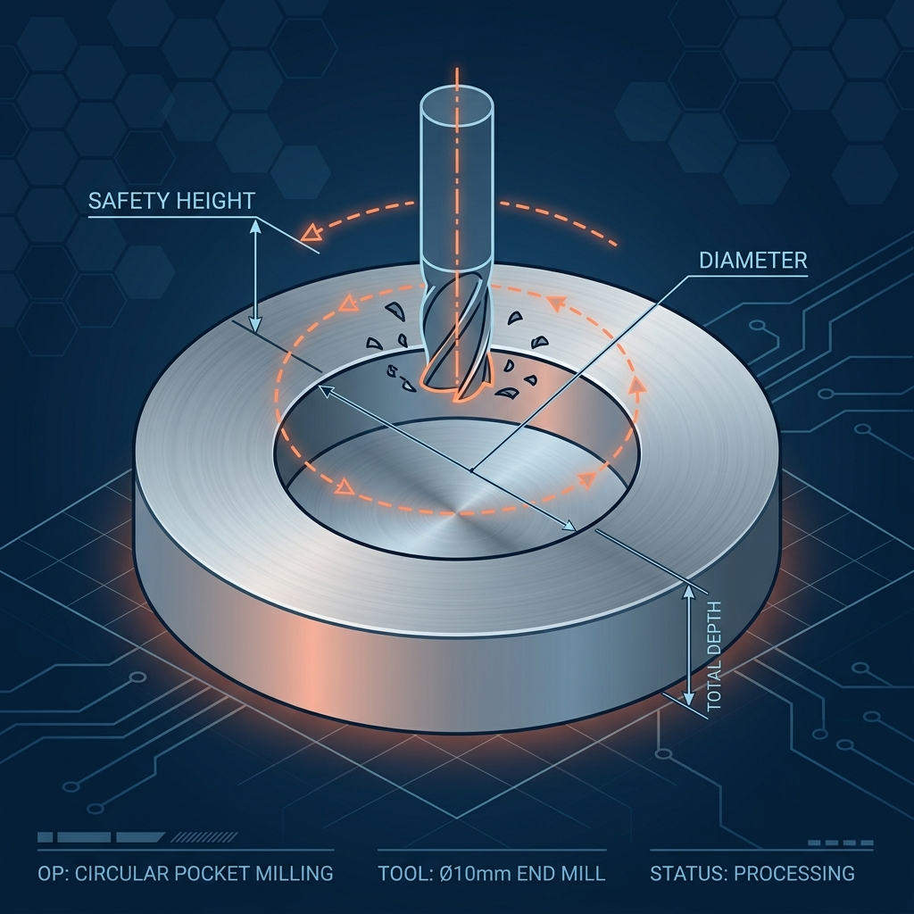
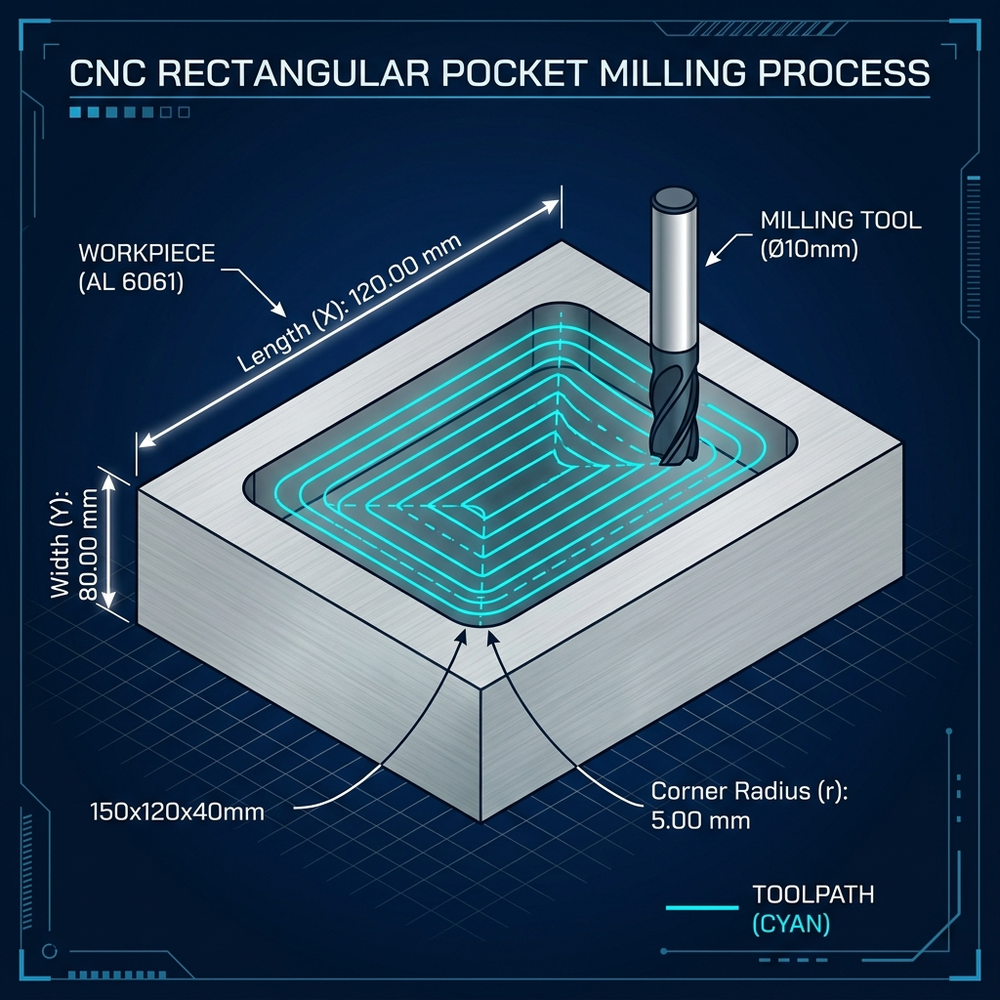

# Manual de Usuario: Aplicación de Macros CNC Paramétricas (NG CNC)

¡Bienvenido al manual oficial de la aplicación **NG CNC**! Esta herramienta ha sido diseñada para permitirte generar códigos de mecanizado CNC (Código G) de forma rápida y sencilla mediante el uso de plantillas inteligentes (macros). 

No es necesario que seas un programador experto en código G o que tengas formación técnica avanzada. Este manual te explicará de forma sencilla cómo funciona la interfaz, cómo interactuar con el simulador en 2D y 3D, y qué significa cada una de las variables en las 8 macros disponibles.

---

## Índice
1. [¿Qué es la Programación Paramétrica?](#1-qué-es-la-programación-paramétrica)
2. [Guía de Uso de la Interfaz Web](#2-guía-de-uso-de-la-interfaz-web)
3. [El Módulo de Simulación (2D y 3D Isométrico)](#3-el-módulo-de-simulación-2d-y-3d-isométrico)
4. [Explicación Detallada de las 8 Macros](#4-explicación-detallada-de-las-8-macros)
5. [Consideraciones de Seguridad en la Máquina Real](#5-consideraciones-de-seguridad-en-la-máquina-real)

---

## 1. ¿Qué es la Programación Paramétrica?

En el mecanizado CNC tradicional, si quieres hacer una cajera (un agujero en forma de piscina) y luego decides cambiar su diámetro, tendrías que volver a dibujar la pieza en un software CAD/CAM y volver a generar todo el programa.

La **programación paramétrica** soluciona esto usando **plantillas ajustables**. En lugar de escribir trayectorias fijas, la macro utiliza variables (identificadas con el símbolo `#` y un número, por ejemplo, `#1`). 
* Tú solo escribes las dimensiones (los parámetros) en la página web.
* La aplicación calcula de inmediato la trayectoria completa de corte.
* Obtienes un archivo de código G listo para cargar en tu máquina CNC.

---

## 2. Guía de Uso de la Interfaz Web

La interfaz de usuario está dividida en secciones claras y modernas:

```
+-------------------------------------------------------------+
|  NG CNC  [ Macros ] [ Simulación ] [ Herramientas ] [ Historial ]  |
+-------------------------------------------------------------+
| Barra Lateral  | Formulario de Variables  | Consola DRO     |
| (Lista de      | (Ingresar dimensiones)   | (X, Y, Z, RPM)  |
|  las 8 macros) |                          |                 |
|                |--------------------------|-----------------|
|                | Editor de Código G       | Pantalla de     |
|                | (Visualizar / Copiar)    | Simulación      |
+-------------------------------------------------------------+
```

### Paso 1: Ingreso e Introducción de la Licencia
Al abrir la aplicación por primera vez, verás una ventana flotante solicitando una clave. 
* Para acceder como administrador con todos los privilegios, introduce la clave maestra: **`ngcnc2026`** y presiona activar. Esto te otorgará acceso permanente.

### Paso 2: Seleccionar una Macro
En la barra lateral izquierda, verás las 8 macros disponibles (por ejemplo, *Cajera Circular*, *Fresado de Roscas*, *Ranura Cerrada*). Haz clic sobre la macro que deseas programar. De inmediato, se cargarán los parámetros predeterminados.

### Paso 3: Configurar las Variables
En el panel central aparecerán las casillas donde debes ingresar las medidas de tu pieza, los datos de la herramienta, las velocidades y los niveles de profundidad. **Ingresa los valores solo en milímetros (mm) o en revoluciones por minuto (RPM) según se indique.**

### Paso 4: Generar y Copiar el Código G
Una vez definidos los parámetros:
1. Haz clic en el botón **"Ejecutar y Generar Código G"**.
2. La terminal de código mostrará el programa CNC completo listo para usar.
3. Presiona **"Copiar Código G"** para guardarlo en tu portapapeles, o cópialo directamente para guardarlo en un archivo con extensión `.nc` (por ejemplo, `mi_programa.nc`) para llevarlo a la máquina por USB.

---

## 3. El Módulo de Simulación (2D y 3D Isométrico)

Antes de cortar metal real, es vital comprobar que la trayectoria sea la correcta para evitar costosas colisiones o roturas de herramientas. Para ello dispones de la pestaña **Simulación**.

### Controles de la Simulación
* **Play (▶️), Pausa (⏸️), Detener (⏹️):** Te permiten controlar el avance del mecanizado virtual.
* **Velocidad de Simulación:** Permite acelerar el recorrido desde 1x hasta 20x para no esperar en operaciones largas.
* **DRO (Visualizador Digital):** Muestra en tiempo real las coordenadas exactas $X, Y, Z$, los RPM y la velocidad de avance ($F$). También verás una barra dinámica de **Spindle Load (Carga de Husillo)** que cambia según si la herramienta está realizando un corte pesado o moviéndose por el aire.
* **Materiales:** Puedes seleccionar entre **Acero**, **Aluminio**, **Cobre** o **Madera**. El color de la pieza virtual cambiará para simular la textura del material real.
* **Parada de Emergencia (E-STOP):** El gran botón rojo detiene de inmediato la simulación y bloquea el panel en caso de que detectes un comportamiento extraño, simulando la parada física de tu máquina.

### Alternar a la Vista 3D Isométrica
Al presionar el botón **"Vista 3D"** en la tarjeta de estado, la pantalla cambia de una vista plana a una simulación tridimensional:
* **Perspectiva Isométrica:** La cámara utiliza una proyección técnica ortográfica (sin deformación de perspectiva) que muestra la pieza en el ángulo perfecto de ingeniería.
* **Interacción:** Haz clic izquierdo y arrastra para **rotar** la pieza en 3D; usa el click derecho para **desplazarla**; y gira la rueda del mouse para hacer **zoom**.
* **Identificación del Movimiento por Colores:**
  * **Líneas Blancas:** Desplazamientos rápidos en el aire ($G00$). Aquí la herramienta no corta.
  * **Líneas Naranjas:** Pasadas de desbaste en avance controlado ($G01/G02/G03$). Remueven la mayor cantidad de material.
  * **Líneas Turquesas:** Recorrido final de acabado superficial. Aseguran la medida exacta y un acabado liso.

---

## 4. Explicación Detallada de las 8 Macros

A continuación, se detalla qué hace cada macro y qué significa cada una de sus variables de programación.

---

### Macro 1: Arreglo Circular de Agujeros (Brida / Círculo de Pernos)
Se utiliza para realizar una serie de taladrados repartidos uniformemente a lo largo de una circunferencia. Es muy común para fabricar bridas o acoples de tuberías.



#### Tabla de Variables:
| Variable | Parámetro en Pantalla | Qué significa y cómo configurarlo |
| :---: | :--- | :--- |
| **#1** | Diámetro del Círculo | El diámetro del círculo sobre el cual se distribuirán los centros de los agujeros. |
| **#2** | Número de Agujeros | Cantidad total de taladrados a realizar en el patrón (ej: 4, 6, 8, 12). |
| **#3** | Diámetro de la Broca | El diámetro físico de la broca instalada. Sirve para dibujar la escala en el simulador. |
| **#4** | RPM (Velocidad de Giro) | Velocidad de rotación del husillo. |
| **#5** | Avance F | Velocidad de avance de la broca al taladrar en vertical (mm/min). |
| **#6** | Profundidad Total | La profundidad final del taladrado (medida desde el plano Z inicial hacia abajo). |
| **#7** | Estrategia (0/1) | **0 = Taladrado Directo** (entra de un solo golpe).<br>**1 = Taladrado con Picoteo** (entra por pasadas cortas y sale para limpiar viruta). |
| **#8** | Paso de Picoteo | Si usas Picoteo, define la profundidad de cada penetración antes de volver a subir. |
| **#9** | Seguridad sobre Pieza | Distancia segura en el aire (Z+) donde la máquina se moverá rápido antes de taladrar. |
| **#10** | Centro X | Posición X del centro del patrón respecto al cero de la máquina. |
| **#11** | Centro Y | Posición Y del centro del patrón respecto al cero de la máquina. |
| **#12** | Z Inicial | El nivel de altura donde empieza el material (generalmente 0). |
| **#13** | Ángulo Inicial | Ángulo en grados del primer agujero respecto a la horizontal (ej: 0° empieza a las 3 en punto). |
| **#14** | Agujero de Inicio | Número del agujero desde donde iniciará el taladrado (por defecto 1). |
| **#15** | Agujero Final | Número del agujero donde terminará (permite hacer patrones parciales). |
| **#20** | Número de Herramienta | Número de la herramienta en el almacén/magazín (para cambio de herramienta T y compensación de longitud H). |

---

### Macro 2: Macho Circular Central (Circular Boss)
Sirve para mecanizar la superficie exterior de una pieza dejando un cilindro central elevado (macho). En lugar de vaciar un círculo, esta macro desgasta todo lo que está alrededor de un diámetro dado.

#### Tabla de Variables:
| Variable | Parámetro en Pantalla | Qué significa y cómo configurarlo |
| :---: | :--- | :--- |
| **#1** | Diámetro Exterior Inicial | El diámetro original del bloque de material en bruto. |
| **#2** | Diámetro Final del Macho | El diámetro final que tendrá el cilindro central después de mecanizar. |
| **#3** | Diámetro de la Herramienta | Diámetro de la fresa de corte que vas a utilizar. |
| **#4** | Profundidad Total Z | Altura del macho o profundidad del escalón que se va a desgastar (ej: 10). |
| **#5** | Pasada en Z | Cuántos milímetros desciende la herramienta en profundidad en cada nivel de corte. |
| **#6** | Paso Radial (Paso Lateral)| Distancia máxima en milímetros que se desplaza la herramienta hacia los lados en cada pasada. |
| **#7** | Sobrematerial Pared | Material extra que se deja en las paredes durante el desbaste para limpiarlo en el acabado. |
| **#8** | Sobrematerial Fondo | Espesor extra que se deja en el fondo del escalón antes del acabado. |
| **#9** | Plano de Retroceso R | Altura segura en Z a la que sube la fresa para realizar movimientos rápidos. |
| **#10** | Velocidad de Corte (Vc) | Velocidad del cortador en metros por minuto. Ayuda a autocalcular los RPM óptimos. |
| **#11** | Número de Insertos | Cantidad de filos o dientes de la fresa. |
| **#12** | Avance por Inserto (fz) | Avance en mm que realiza cada filo por vuelta. Autocalcula el avance F del husillo. |
| **#13** | Centro X | Coordenada X del centro del macho. |
| **#14** | Centro Y | Coordenada Y del centro del macho. |
| **#15** | Z Inicial | Altura donde empieza a cortar la herramienta. |
| **#16** | Opción (0 / 1 / 2) | **0 = Desbaste y Acabado** (Completo).<br>**1 = Solo Desbaste** (deja el sobrematerial).<br>**2 = Solo Acabado** (limpia el contorno final). |
| **#20** | Número de Herramienta | Número de la herramienta en el almacén/magazín (para cambio de herramienta T y compensación de longitud H). |

---

### Macro 3: Cajera Circular (Circular Pocket)
Se utiliza para realizar un vaciado redondo (como un agujero ciego o pasante de gran diámetro) usando una herramienta más pequeña. La herramienta entra en el centro y se desplaza en círculos concéntricos hacia afuera.

#### Tabla de Variables:
| Variable | Parámetro en Pantalla | Qué significa y cómo configurarlo |
| :---: | :--- | :--- |
| **#1** | Diámetro Final de Caja | El diámetro del agujero circular final que deseas obtener. |
| **#2** | Diámetro de la Herramienta | El diámetro de la fresa con la que realizarás el vaciado. |
| **#3** | Profundidad Total Z | Profundidad total del agujero (valor positivo). |
| **#4** | Pasada Z Desbaste | Altura que desciende en Z la fresa en cada nivel antes de limpiar en espiral. |
| **#5** | Sobrematerial Acabado | Milímetros extra que se dejan en las paredes de la cajera para la pasada de acabado. |
| **#6** | Velocidad de Corte (Vc) | Velocidad de corte recomendada para el material en m/min. |
| **#7** | Número de Labios | Número de filos cortantes de la fresa. |
| **#8** | Avance por Labio (fz) | Avance por revolución y por diente de la fresa. |
| **#9** | Plano de Seguridad R | Altura segura Z en el aire a la que subirá la herramienta entre pasadas rápidas. |
| **#10** | Centro en X | Coordenada X del centro del círculo. |
| **#11** | Centro en Y | Coordenada Y del centro del círculo. |
| **#12** | Paso Radial Máximo | Cuánto material come de lado la fresa al limpiar desde el centro hacia afuera (mm). |
| **#14** | Z Inicial / Reinicio | Altura Z desde donde empieza a cortar (por defecto 0). |
| **#15** | Radio de Arco Acabado | Radio del arco de entrada suave que hace la herramienta para no marcar la pared en el acabado. |
| **#16** | Opción (0 / 1 / 2) | **0 = Ambos** (Desbaste + Acabado).<br>**1 = Solo Desbaste**.<br>**2 = Solo Acabado**. |
| **#20** | Número de Herramienta | Número de la herramienta en el almacén/magazín (para cambio de herramienta T y compensación de longitud H). |

---

### Macro 4: Cajera Rectangular (Rectangular Pocket)
Crea una cavidad rectangular en el material. Es ideal para rebajes, alojamientos de motores, cajones o cuñeros anchos. Permite redondear las esquinas interiores automáticamente.



#### Tabla de Variables:
| Variable | Parámetro en Pantalla | Qué significa y cómo configurarlo |
| :---: | :--- | :--- |
| **#1** | Longitud X de la Caja | Medida del lado largo de la cajera en la dirección X. |
| **#2** | Ancho Y de la Caja | Medida del lado corto de la cajera en la dirección Y. |
| **#3** | Radio en las Esquinas | Radio interno en las 4 esquinas del rectángulo (no puede ser menor al radio de la fresa). |
| **#4** | Diámetro de la Herramienta | Diámetro de la fresa a utilizar. |
| **#5** | Profundidad Total Z | Profundidad del rebaje rectangular (valor positivo). |
| **#6** | Pasada en Z Desbaste | Profundidad que corta la herramienta en cada pasada vertical. |
| **#7** | Sobrematerial Acabado | Espesor de material para la limpieza final. |
| **#8** | Velocidad de Corte (Vc) | Parámetro Vc para el cálculo automático de los RPM. |
| **#9** | Número de Labios | Filos de la fresa. |
| **#10** | Avance por Labio (fz) | Avance por diente. |
| **#11** | Plano de Seguridad R | Altura segura de traslado rápido en el aire. |
| **#12** | Centro en X | Coordenada X del centro del rectángulo. |
| **#13** | Centro en Y | Coordenada Y del centro del rectángulo. |
| **#14** | Paso Radial Máximo XY | Paso lateral máximo de la fresa al limpiar el rectángulo por dentro. |
| **#15** | Z Inicial / Reinicio | Plano Z inicial del material. |
| **#16** | Radio de Arco Acabado | Radio de entrada tangencial en arco para el acabado de las paredes. |
| **#17** | Opción (0 / 1 / 2) | **0 = Completo**, **1 = Solo Desbaste**, **2 = Solo Acabado**. |
| **#20** | Número de Herramienta | Número de la herramienta en el almacén/magazín (para cambio de herramienta T y compensación de longitud H). |

---

### Macro 5: Ranura Cerrada (Chavetero / Ranura Inclinada)
Sirve para fresar ranuras lineales o colisas (ranuras con dos semicírculos en los extremos). Esta macro permite posicionar la ranura en cualquier ángulo de inclinación respecto al eje horizontal.

#### Tabla de Variables:
| Variable | Parámetro en Pantalla | Qué significa y cómo configurarlo |
| :---: | :--- | :--- |
| **#1** | Longitud entre Centros (L) | Distancia en línea recta medida desde el centro del círculo izquierdo al derecho. |
| **#2** | Radio de la Ranura | El radio del semicírculo de los extremos. El ancho total de la ranura será el doble. |
| **#3** | Ángulo de Inclinación | Ángulo en grados para girar la ranura (ej: 0° es horizontal, 45° es diagonal hacia arriba). |
| **#4** | Diámetro de la Herramienta | Diámetro de la fresa (debe ser menor o igual al ancho de la ranura). |
| **#5** | Profundidad Total Z | Profundidad final del canal (valor positivo). |
| **#6** | Pasada en Z Desbaste | Cuánto desciende en Z vertical la herramienta por cada nivel. |
| **#7** | Sobrematerial Acabado | Milímetros extra que se dejan para el acabado de las paredes laterales. |
| **#8** | Velocidad de Corte (Vc) | Velocidad lineal de corte en m/min. |
| **#9** | Número de Labios | Cantidad de filos de la herramienta. |
| **#10** | Avance por Labio (fz) | Carga por diente. |
| **#11** | Plano de Seguridad R | Altura segura para movimientos en rápido. |
| **#12** | Centro en X | Coordenada X del centro geográfico de la ranura. |
| **#13** | Centro en Y | Coordenada Y del centro geográfico de la ranura. |
| **#14** | Paso Radial Máximo | Desplazamiento lateral de la herramienta para limpiar el fondo si la ranura es ancha. |
| **#15** | Z Inicial / Reinicio | Plano de partida del mecanizado en Z. |
| **#16** | Radio de Arco Acabado | Radio del movimiento circular de aproximación de la pasada de acabado. |
| **#17** | Opción (0 / 1 / 2) | **0 = Completo**, **1 = Solo Desbaste**, **2 = Solo Acabado**. |
| **#20** | Número de Herramienta | Número de la herramienta en el almacén/magazín (para cambio de herramienta T y compensación de longitud H). |

---

### Macro 6: Fresado de Roscas Helicoidal (Thread Milling)
Se utiliza para realizar roscado interior en agujeros previamente taladrados, usando una fresa especial de roscar. La fresa entra al centro, se aproxima a la pared y desciende (o asciende) de forma helicoidal siguiendo el paso exacto de la rosca.

#### Tabla de Variables:
| Variable | Parámetro en Pantalla | Qué significa y cómo configurarlo |
| :---: | :--- | :--- |
| **#1** | Diámetro Nominal Rosca | El diámetro exterior máximo de la rosca interior (ej: M64 -> 64mm). |
| **#2** | Diámetro Fresa de Roscar | Diámetro exterior medido de la fresa especial de roscar. |
| **#3** | Profundidad de la Rosca | Qué tan profundo en Z llegará la rosca tallada (valor positivo). |
| **#4** | Paso de la Rosca / Pitch | Distancia milimétrica entre filetes consecutivos (ej: paso de 2.0 mm). |
| **#5** | Número de Vueltas | **1** para fresas multipaso (roscan toda la longitud de una sola vuelta helicoidal).<br>**Más de 1** para fresas de un solo hilo (requieren recorrer toda la rosca vuelta a vuelta). |
| **#6** | Velocidad de Corte (Vc) | Velocidad de corte recomendada de la fresa en m/min. |
| **#7** | Número de Labios | Cantidad de filos de corte de la herramienta de roscar. |
| **#8** | Avance por Labio (fz) | Avance por diente para mecanizado circular del filete. |
| **#9** | Plano de Seguridad R | Plano seguro en Z para aproximaciones rápidas. |
| **#10** | Centro X | Coordenada X del eje del agujero roscado. |
| **#11** | Centro Y | Coordenada Y del eje del agujero roscado. |
| **#20** | Número de Herramienta | Número de la herramienta en el almacén/magazín (para cambio de herramienta T y compensación de longitud H). |

---

### Macro 7: Patrón Rectangular de Agujeros (Marco de Agujeros / Grill)
Permite realizar una cuadrícula rectangular o marco de taladrados. Es ideal para placas base, patrones de fijación de tornillos en esquinas o parrillas de agujeros.

#### Tabla de Variables:
| Variable | Parámetro en Pantalla | Qué significa y cómo configurarlo |
| :---: | :--- | :--- |
| **#1** | Longitud Total X del Marco | Distancia horizontal X entre el centro de la columna izquierda y la derecha. |
| **#2** | Ancho Total Y del Marco | Distancia vertical Y entre el centro de la fila inferior y la superior. |
| **#3** | Cantidad Agujeros en X | Número de agujeros a realizar a lo largo del eje X (mínimo 2). |
| **#4** | Cantidad Agujeros en Y | Número de agujeros a realizar a lo largo del eje Y (mínimo 2). |
| **#5** | RPM (Velocidad Giro) | Revoluciones por minuto del husillo para la broca. |
| **#6** | Avance F | Velocidad de penetración de taladrado (mm/min). |
| **#7** | Profundidad Z Total | Profundidad final de los taladrados (valor positivo). |
| **#8** | Estrategia (0 / 1) | **0 = Directo** (Taladrado directo).<br>**1 = Picoteo** (Rompe la viruta bajando de a pasos). |
| **#9** | Paso de Picoteo | Si usas Picoteo, la profundidad de cada nivel de penetración. |
| **#10** | Seguridad Z | Distancia en el aire sobre el material donde inicia la velocidad de taladrado. |
| **#11** | Centro X | Coordenada X del centro geométrico del marco. |
| **#12** | Centro Y | Coordenada Y del centro geométrico del marco. |
| **#13** | Z Inicial | Plano de partida del taladrado en el eje Z. |
| **#20** | Número de Herramienta | Número de la herramienta en el almacén/magazín (para cambio de herramienta T y compensación de longitud H). |

---

### Macro 8: Ranura Tipo O-Ring (Canal de Empaque Hermético)
Especialmente programada para fresar canales circulares concéntricos que alojan empaques de goma redondos (O-rings) para sellar tapas de motores, pistones o tanques de presión. Realiza un descenso helicoidal constante muy suave.

#### Tabla de Variables:
| Variable | Parámetro en Pantalla | Qué significa y cómo configurarlo |
| :---: | :--- | :--- |
| **#1** | Diámetro de la Ranura | El diámetro al centro de la ranura circular (donde pasará el centro del cortador). |
| **#2** | Diámetro de la Herramienta | Diámetro de la fresa cilíndrica. El ancho de la ranura final será igual a este diámetro. |
| **#3** | Profundidad Total Z | Profundidad del canal del O-ring (valor positivo). |
| **#4** | Profundidad por Vuelta (Pitch)| El paso helicoidal. Cuánto desciende en Z la fresa por cada giro completo de 360°. |
| **#5** | Velocidad de Corte (Vc) | Velocidad de corte recomendada para el material en m/min. |
| **#6** | Número de Labios | Filos cortantes de la fresa. |
| **#7** | Avance por Labio (fz) | Avance por diente de fresado. |
| **#8** | Plano de Seguridad R | Altura segura Z para movimientos en vacío. |
| **#9** | Centro en X | Coordenada X del centro de la ranura circular. |
| **#10** | Centro en Y | Coordenada Y del centro de la ranura circular. |
| **#14** | Z Inicial | Altura Z de inicio del mecanizado. |
| **#20** | Número de Herramienta | Número de la herramienta en el almacén/magazín (para cambio de herramienta T y compensación de longitud H). |

---

## 5. Consideraciones de Seguridad en la Máquina Real

Aunque el simulador muestra un mecanizado perfecto, en el taller debes seguir estas pautas para proteger tu máquina, tu herramienta y tu salud:

1. **Establecer el Cero Pieza Correctamente (X0 Y0 Z0):**
   * En todas las macros, el cero de las coordenadas **X e Y** está localizado en el **centro** del patrón o de la cavidad (excepto si programas el desfase en las variables de centro X/Y). Asegúrate de posicionar la aguja detectora o el palpador en el centro real de tu bloque de metal.
   * El cero en **Z (Z0)** corresponde siempre a la **superficie superior del bloque de material**.
2. **Revisar las Alturas de Seguridad:**
   * Nunca reduzcas la variable **Plano de Seguridad R (o Seguridad Z)** por debajo de 5 mm. Si hay bridas de sujeción, tornillos o grapas sujetando el bloque, asegúrate de que el plano seguro de retroceso sea lo suficientemente alto para saltarlas sin chocar.
3. **Sentido de Giro:**
   * La aplicación genera trayectorias para **Fresado Concordante (Climb Milling)** mediante el uso de códigos `G03` para cajeras internas. Esto reduce el desgaste y da mejor acabado, pero requiere que el husillo de la máquina gire a derechas (sentido horario, comando `M03`).
4. **Verificación en Vacío:**
   * Te sugerimos realizar la primera corrida del programa en tu máquina "en el aire" (retirando el bloque de material o levantando el cero Z unos 50 mm por encima de la pieza). Así podrás comprobar visualmente que los movimientos de la máquina física coincidan exactamente con lo que viste en la **Vista 3D** de la aplicación web.
